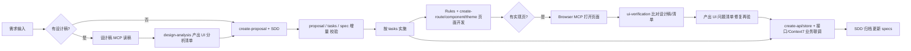

你是不是也遇到过这些情况：AI 生成的代码风格和现有项目不一致；项目结构不符合预期，设计稿要么看不懂、要么分析漏项，页面 UI 还原度低；改来改去返工多，需求越走越偏，最后还得自己重写一版？ 

我在实际项目里经过多次迭代的实践，落地了一套

**以规范、能力扩展和流程为主线的 AI Coding 架构**

把「风格不一致、步骤漏、设计稿不会分析/验收、提案任务格式乱」都收进可控范围。落地之后最直观的效果是：

**前端页面可以做到 90% 还原设计稿，需求实现更准确，代码风格一致，结构设计合理**

---

## 架构简介

架构运用了多种现下流行的 Agent 通用能力：

| 架构组成 | 说明 |
| --- | --- |
| SDD | 开发流程控制，保证需求不遗漏，开发不脱节，可进行需求分析/开发规划/验收测试/复盘归档 |
| MCP | 对接外部能力，如设计稿读取、浏览器访问页面查看实际效果、接口文档 |
| Rules | 约定「做什么、不做什么」，如保证 AI 遵循项目结构，规范约束，代码风格 |
| Skills | 约定「怎么做」，渐进披露按需指导 AI 怎么做，如怎么写UI，怎么验收UI |

**Rules 管「怎么才算对」，Skills 管「怎么一步步做」，MCP 让 Agent 能看到真实世界，而 SDD 负责记录「这次为什么要改、应该改成什么样」并把每次变更沉淀成新的真相**，四者合在一起，才是真正稳定可演进的 AI Coding 底座。

从需求到归档的完整链路如下：




1. **需求输入**：明确是否有设计稿、是否有接口、交付形态（页面/组件/其它）。
2. **设计稿分析**（有稿时）：用 Pencil（或 Figma）MCP 读稿 → 执行 design-analysis 技能 → 产出 UI 分析清单。
3. **创建提案**：执行 create-proposal，产出 SDD 的 proposal、tasks、spec 增量；若有设计稿，在 tasks 中写明依据 UI 分析清单实现、实现后用 ui-verification 验收；validate 通过后进入实施。
4. **页面/UI 开发**：按 tasks 顺序做；读 Rules（项目结构、组件、路由、样式等）+ Skills（create-route、create-component、theme-variables）；依据 UI 分析清单还原布局与样式。
5. **UI 验收**：用 Cursor IDE Browser（或 Playwright）打开实现页，执行 ui-verification，与设计稿或分析清单比对，按 P0/P1/P2 产出问题清单；修复后再次用 Browser 验证。
6. **业务开发与联调**：Rules（API、状态、通用约束）+ create-api、create-store；接口文档 MCP、Context7 按需使用。
7. **归档**：tasks 全部勾选后执行 SDD archive，更新 specs，变更挪入 archive。

---

## 主流 Agent 通用

本套架构方案，适用所有支持 skills/mcp 的 Agent，且
 **只维护一份，所有 Agent 共用**：
 
首先在你的项目根目录创建 **`.agents`**，下面放 `rules` 和 `skills`，然后根据你所使用的 Agent 或多个 Agent 做如下配置：

- **Cursor**：在项目根创建 `.cursor` 目录，其下的 `rules`、`skills` 用 **软链接** 指到 `.agents/rules`、`.agents/skills`。
- **Claude**：同理，创建 `.claude`，将 `rules`、`skills` 软链到 `.agents` 下同名目录。
- **OpenCode**：创建 `.opencode`，同理软链。
- **Gemini**：创建 `.agent`，同理软链。
- **Trae**：创建 `.trae`，同理软链。

这样只需维护 `.agents` 一份，即可同时支持上述所有 Agent。

**目录结构示例**（仅展示与本文相关的部分）：

```text
项目根/
├── .agents/                    # 唯一维护的规范与技能目录
│   ├── rules/                  # 规则
│   └── skills/                 # 技能
│
├── .cursor/                    # Cursor：内部 rules、skills 软链到 .agents
├── .claude/                    # Claude：同上
├── .opencode/                  # OpenCode：同上
├── .agent/                     # Gemini：同上
└── .trae/                      # Trae：同上
```

---

## SDD

**SDD 是什么**  
Specification-Driven Development，用「规范/spec」来驱动开发：

- **先写 spec 再写代码**：任何需求或变更，先写清楚需求，「现在是怎样 → 期望变成怎样」，再开干；
- **变更可追踪**：变更以「提案 + 任务 + spec 增量」管理，实施完归档，可回溯是谁、什么时候、为什么改了什么；
- **验收有据可依**：验收按 spec 来，而不是「感觉差不多」。

**SDD 的选择**  

Spec-kit 和 OpenSpec 是两个比较热门的 SDD 工具，我在尝试过两个工具后，最终选择使用 openspec 因为他比 speckit 简单很多，speckit 的流程更严谨，也更繁琐，其复杂度适合从 0 到 1 规划一个新项目。

**OpenSpec**

通过 `openspec init` 初始化项目后，你就会得到如下的一个典型的 OpenSpec 目录：

```text
openspec/
├── project.md          # 项目约定与 AI 使用说明
├── specs/              # 当前「真相」：已经生效的能力与约束
└── changes/            # 进行中的变更：proposal、tasks、design、spec 增量
    ├── <change-id>/
    │   ├── proposal.md
    │   ├── tasks.md
    │   ├── design.md      # 可选：草图/交互/边界情况
    │   └── spec-delta.md  # 本次变更对 specs 的增量
    └── ...
```

首先你需要编写 `project.md`，将你项目的规范告诉 openspec，以此作为规范进行推动后续的工作，这是我项目的 `project.md`，起初也是一个庞大的文件，现在已经拆分到 rules 和 skills 了（后面会介绍）：

```markdown
# 项目上下文

## 项目概述

当前项目是一个基于 React + TypeScript 的单页应用（SPA）。

## 技能与规范

本项目定义了两层指导体系，统一存放在 `.agents/` 目录下。

### `.agents/rules/` - 开发规范

规范文件包含项目开发的核心规则，不会自动加载。当需要确认规范时，主动读取对应文件：

| 文件             | 何时读取                   |
| ---------------- | -------------------------- |
| `01-项目概述.md` | 需要了解项目背景、技术栈时 |
| `02-编码规范.md` | 编写或审查代码时           |
| `03-项目结构.md` | 确定代码应放在哪个目录时   |
| `04-组件规范.md` | 创建或拆分组件时           |
| `05-API规范.md`  | 新增或修改接口时           |
| `06-路由规范.md` | 新增页面或配置路由时       |
| `07-状态管理.md` | 新增或重构状态管理时       |
| `08-通用约束.md` | 确认通用约束时             |
| `09-样式规范.md` | 编写组件样式或主题适配时   |
| `10-文档规范.md` | 编写或审查代码注释时       |
| `11-测试规范.md` | 确认测试要求时             |

### `.agents/skills/` - 实践技能

技能文件包含具体落地步骤与示例代码，按需读取：

| 场景              | 技能文件                                   |
| ----------------- | ------------------------------------------ |
| 创建提案时        | `.agents/skills/create-proposal/SKILL.md`  |
| 新增接口          | `.agents/skills/create-api/SKILL.md`       |
| 创建/拆分组件     | `.agents/skills/create-component/SKILL.md` |
| 新增页面路由      | `.agents/skills/create-route/SKILL.md`     |
| 新增全局状态      | `.agents/skills/create-store/SKILL.md`     |
| 编写样式/主题适配 | `.agents/skills/theme-variables/SKILL.md`  |

技能索引文件：`.agents/skills/README.md`

```

配置了规范后，就可以使用 openspec 的指令进行需求的实现，先是 `openspec proposal` 创建提案，Agent 会根据你的描述，生成详细的需求文档，规划开发任务，待你确认。

开发任务确认后，再执行 `openspec apply` 开始实施任务，任务完成 `openspec archive` 对本次需求归档，这会作为后续新需求的一个参考，让 Agent 对项目的现状更了解。

**OpenSpec 在这套架构里的作用**  
结合前面讲的 Rules / Skills / MCP，这里的 OpenSpec 主要在三个环节发力：

- **需求 / 变更收敛**：不管输入来自 PRD、口头、IM 还是设计稿，先用 OpenSpec 写一条变更（proposal + tasks + spec 增量），把「要改什么、影响到哪里」说清楚，避免 AI 直接在代码上「盲改」；
- **开发执行对齐**：开发时，Agent 读取对应变更的 proposal / tasks / spec 增量，再结合 Rules（项目级约束）、Skills（如 create-route / create-api / design-analysis）和 MCP（设计稿 / 浏览器 / 接口文档），按 tasks 一项项完成，实现过程始终围绕同一份 spec 展开；
- **验收与归档**：UI 验收阶段，ui-verification 会同时参考 UI 分析清单（design-analysis 产物）和 OpenSpec 中的 spec 增量，验证是否满足这次变更的业务与交互预期；验收通过后，将变更移动到 archive，并把 spec 增量合到 specs，下次再改同一块能力时，所有上下文都在这里。


---

## MCP

**MCP 是什么**：Model Context Protocol，模型通用的上下文协议，让模型能安全、结构化地调用外部能力。设计稿、浏览器、接口文档等通过 MCP 暴露成工具，Agent 按需调用，拿到真实数据或执行真实操作。

这套架构中用到如下的 MCP：

| MCP | 用途 | 环节 | 说明 |
|-----|------|------|------|
| Pencil | .pen 设计稿结构、布局、节点、截图 | 设计稿分析 | 设计稿分析首选，效果优于 Figma MCP |
| Figma | Figma 链接的截图与设计上下文 | 设计稿分析（Figma 稿时） | 有 .pen 时优先 Pencil |
| Cursor IDE Browser | 打开页面、快照、截图 | UI 验收 | Cursor 内优先，效果优于 Playwright |
| Playwright | 页面打开、截图、自动化 | UI 验收（非 Cursor 或脚本化） | 可作为 Browser 的补充 |
| ApiFox | OAS 等接口定义 | 业务开发/联调 | 按当前文档生成/校验请求 |
| Context7 | 主流库最新文档与示例注入 | 页面/业务开发 | 避免过时 API、幻觉 |

**设计稿类**

- **Pencil MCP**：面向 `.pen` 设计稿。能读层级、节点、布局、截图（如 `snapshot_layout`、`get_screenshot`、`batch_get` 等），把设计稿里的元素尺寸、间距、字体、颜色直接触达 Agent。在「设计稿分析」环节作为主数据源，**效果明显好于 Figma MCP**——层级与细节更完整，分析清单更准，因此有 .pen 稿时优先用 Pencil。可以直接拷贝 Figma 粘贴到 Pencil 设计稿。
- **Figma MCP**：面向 Figma 链接。可解析 file key / node id、取截图与设计上下文，适合设计稿在 Figma 的场景，但 Figma 可复制到 Pencil ，95%+ 样式复制后还原，个别暂不支持的例如 Pencil 没有虚线边框。

**浏览器类**

- **Cursor IDE Browser**：在 Cursor 内打开目标页、拉快照、截图、简单交互。用于 UI 验收时「真实页面 vs 设计稿」比对。**在 Cursor 里做 UI 验收时，优先用 Cursor IDE Browser，效果比 Playwright MCP 更好**（集成度、稳定性、截图比对流程更顺）。
- **Playwright MCP**：同样可打开页面、截图、操作，适合不在 Cursor 或需要脚本化验收时使用。

**接口与文档类**

- **接口文档 MCP（如 ApiFox）**：读/刷新项目 OAS 等，在业务开发/联调时按当前文档生成或校验请求与类型，避免接口变更后模型用旧假设。
- **Context7**：按需注入当前版本的库文档与代码示例，在页面/业务开发时减少依赖过时、模型幻觉 API 的问题。

---

## Rules

**Rules 是什么**：写在项目里的持久化指导，约定规范、约束和惯例（项目概述、编码、结构、组件、API、路由、状态、样式、文档、测试等），让 Agent 遵守「做什么、不做什么」。

**实践中的演进历程**：
- 最初是一整个大 Rule.md，上下文过大、易丢记忆、难按场景聚焦；
- 后来按模块拆成多份（如 01～11），按需读；
- Skills 加入后，Rules 只需要保留原则与约束，把步骤、检查点、模板、示例迁到 Skills，实现渐进式披露。

**项目级 Rules 清单**：

```markdown
.agents/rules/
├── 01-项目概述.md
├── 02-编码规范.md
├── 03-项目结构.md
├── 04-组件规范.md
├── 05-API规范.md
├── 06-路由规范.md
├── 07-状态管理.md
├── 08-通用约束.md
├── 09-样式规范.md
├── 10-文档规范.md
├── 11-测试规范.md
└── README.md
```

**Rules 目录下的 README 清晰的介绍了各个 rule 的作用和使用时机**：

```markdown
# 项目规范索引

本目录包含前端项目的开发规范，按模块分类组织，便于快速查找。

## 规范模块列表

### 📋 [01-项目概述](./01-项目概述.md)

- 项目定位
- 技术栈

### 💻 [02-编码规范](./02-编码规范.md)

- TypeScript 规范
- 命名规范（文件夹、变量、常量、接口、组件等）
- 业务函数命名（事件处理、内部处理）

### 📁 [03-项目结构](./03-项目结构.md)

- 目录结构概览
- 各目录使用约束（禁止新建非标准目录）

### 🧩 [04-组件规范](./04-组件规范.md)

- 组件结构规范
- 组件层级规划（通用 vs 页面级）

### 🌐 [05-API规范](./05-API规范.md)

- 接口请求规范
- 接口函数命名（NON-NEGOTIABLE）
- 接口错误处理（NON-NEGOTIABLE）

### 🛣️ [06-路由规范](./06-路由规范.md)

- 路由结构规范
- 路由与菜单规范（NON-NEGOTIABLE）

### 🗄️ [07-状态管理](./07-状态管理.md)

- Zustand 使用规范
- Store 组织规范
- 持久化策略

### ⚙️ [08-通用约束](./08-通用约束.md)

- 语言规范（中文注释）
- 可观测性与兜底
- 约束汇总

### 🎨 [09-样式规范](./09-样式规范.md)

- SCSS Modules 使用规范
- 主题色 CSS 变量（NON-NEGOTIABLE）

### 📝 [10-文档规范](./10-文档规范.md)

- 注释规范
- JSDoc 使用

### ✅ [11-测试规范](./11-测试规范.md)

- 测试覆盖要求
- 质量门禁

## 使用说明

1. 根据需要的规范类型，点击对应的模块链接查看详细内容
2. 所有规范文件都包含 `alwaysApply: true` 标记，确保规范自动应用
3. 详细示例与落地步骤见 `.agents/skills/` 目录下的技能文件

## 快速查找

| 需求 | 规范文件 |
|------|----------|
| 项目背景是什么？使用哪些技术栈？ | 01-项目概述 |
| 如何命名函数/变量？ | 02-编码规范 |
| 代码放在哪个目录？ | 03-项目结构 |
| 如何创建/拆分组件？ | 04-组件规范 |
| 如何调用接口？ | 05-API规范 |
| 如何配置路由？ | 06-路由规范 |
| 如何使用 Zustand？ | 07-状态管理 |
| 有哪些通用约束？ | 08-通用约束 |
| 如何使用主题变量？ | 09-样式规范 |
| 如何写注释？ | 10-文档规范 |
| 有何测试要求？ | 11-测试规范 |

```

更详细的 rules 落地示例见：**《前端 AI Coding 落地指南（二）Rules 篇》**。

---

## Skills

**Skills 是什么**：用 Markdown 写的技能文件，教会 Agent 完成某一类任务。一个技能一个目录，必有 `SKILL.md`（YAML 头 + 步骤 + 示例），可带子规则。

**Skills 有什么用**：按场景加载、渐进披露，例如在 Rules 划好边界的前提下给「怎么做」的步骤与示例拆分成 skills，避免大量 rules 导致上下文庞大，模型无法集中，出现幻觉和记忆丢失问题。

**开源 Skills**：

有许多开源的优质 skills，直接安装到你的项目中大有裨益，在我的 React 项目中就用到了以下开源 skills


| 技能 | 简介 | 使用环节 |
|------|------|----------|
| vercel-react-best-practices | React 代码编写的最佳实践 | 页面/业务开发时按需引用 |
| vercel-composition-patterns | 复合组件、状态提升、避免 boolean props 等 | 设计组件 API、组合与状态时 |
| web-design-guidelines | 通用 UI/UX 设计指南 | UI 分析、实现时参考 |
| find-skills | 查找并选用可用技能 | 需要发现技能时 |
| skill-creator | 创建新技能的结构与规范 | 扩展能力、新增 Skills 时 |

**自封装 Skills**：

除了开源 skills，你还可以自己封装 skills，当有固定步骤流程且会反复做的任务时，就可以封装成 Skill。在我的项目中就有以下两类自封装的 skill：

1. 从 Rules「怎么做」拆出来的（create-route、create-component、create-api、create-store、theme-variables）；

2. 可复用的流程，给予 Agent 指导（create-proposal、design-analysis、ui-verification）。

像 design-analysis、ui-verification 这种内容多的技能，还可以再把细分工具能力等拆到技能下的 rules 子目录里，充分发挥渐进披露的优势，SKILL 只做入口说明。

```text
.agents/skills/
├── create-proposal/     # 创建提案（SDD proposal、tasks、spec 增量）
│   └── SKILL.md
├── design-analysis/     # 设计稿分析 → UI 分析清单
│   ├── SKILL.md
│   └── rules/          # 分析顺序、四类重点、工作流、输出模板、工具等
├── ui-verification/    # UI 验收 → 问题清单
│   ├── SKILL.md
│   └── rules/          # 比对维度、常见错误、工作流、工具等
├── create-route/       # 新增路由、Page、Loader
├── create-api/         # 新增接口、类型、请求封装
├── create-store/       # 新增 Zustand store
├── create-component/   # 新增/拆分组件
├── theme-variables/    # 主题 CSS 变量使用
└── README.md
```

**skills 在 AI Coding 过程中发挥的作用**：

- 创建 SDD 提案时同时使用 create-proposal；
- 有设计稿时用 design-analysis 产出 UI 分析清单；
- 页面/UI 开发时用 create-route、create-component、theme-variables；
- 实现完成后用 ui-verification 做还原验收；
- 业务开发/联调时用 create-api、create-store。
- 其他开源第三方 skills 在写代码、做架构决策时按需引用。

**skills 目录下的 README**：

```markdown
---
name: huayiyi-skills-index
description: 前端项目的技能索引，帮助 Agent 在具体开发场景下选择合适的技能文件。
---

# 画衣衣项目技能索引

项目在 `.agents/skills` 下定义了一些与 RULE 配套的技能，用于承载**具体实践步骤与示例代码**，避免在 RULE 中塞入过多细节。

## 当前技能列表

- `create-api`：创建与维护 HTTP 接口（配合 `05-API规范` 使用）
- `create-component`：创建与拆分通用组件/页面级组件（配合 `03/04` 使用）
- `create-route`：创建与维护路由目录与 Loader/Page（配合 `06-路由规范` 使用）
- `create-store`：使用 Zustand 创建与维护全局状态（配合 `07-状态管理` 使用）
- `theme-variables`：正确使用 Antd 与自定义主题 CSS 变量（配合 `09-样式规范` 使用）

后续如有新的实践场景（例如：测试用例编写、文档撰写模板等），也建议以新的技能目录形式补充到本目录中。

```

更详细的 Skills 落地示例见：**《前端 AI Coding 落地指南（三）Skills 篇》**。

---


## 总结

**当下的局限性**：要高接纳率、少返工，需要较好的模型与算力；在无限额度、高配模型下稳定性才有保障，成本不低。配合 git worktree + 多 Agent 多任务并行，不计成本时接近 100% AI Coding 在技术上可行，成本和流程需按团队权衡。

**AI Coding 展望**：模型会更聪明，上下文管理会更智能，交互会更简洁。在这套 MCP + Rules + Skills + SDD 的底座上，只靠 AI Coding 完成日常前端开发不会太远；先跑通「需求 → 提案 → 分析 → 开发 → 验收」闭环，再逐步扩展，接纳率和效率都会有可见提升。

